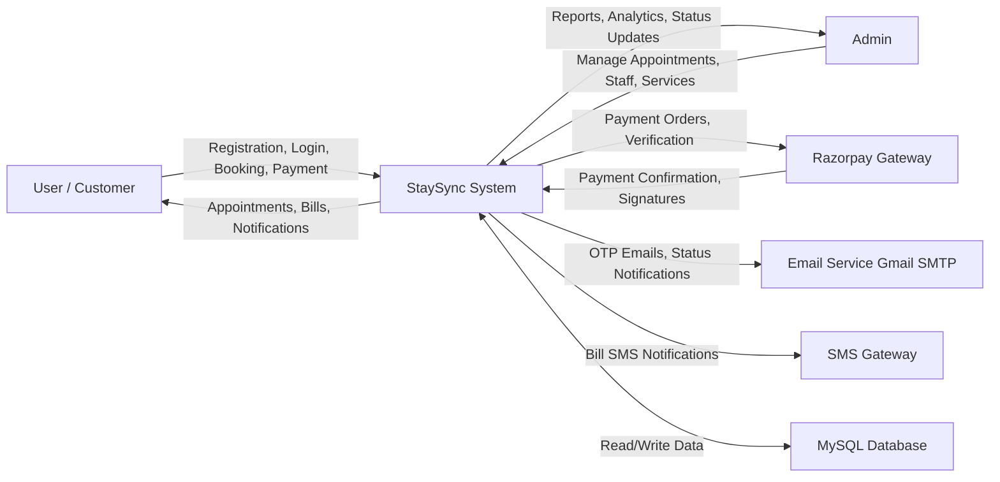
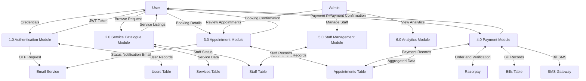
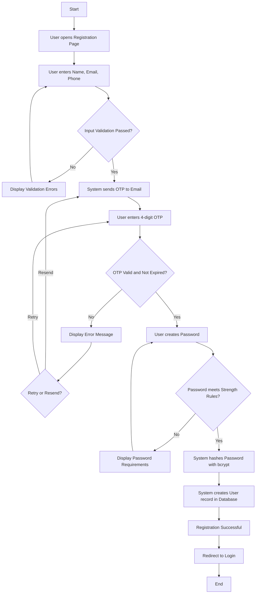
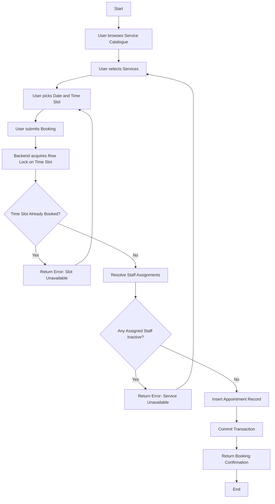
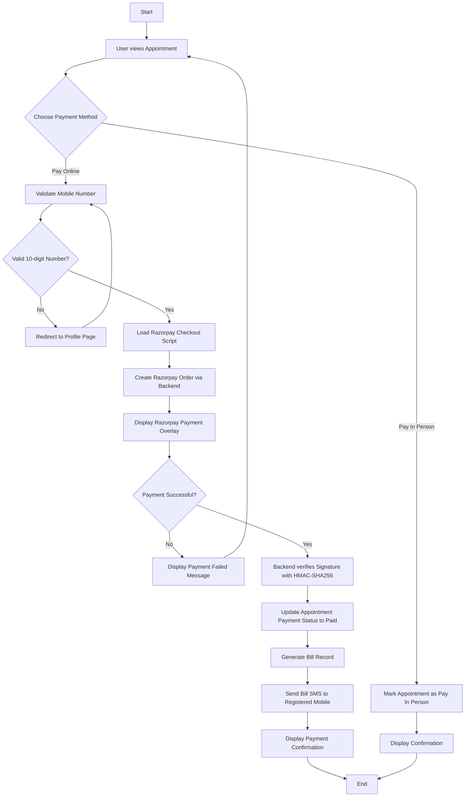
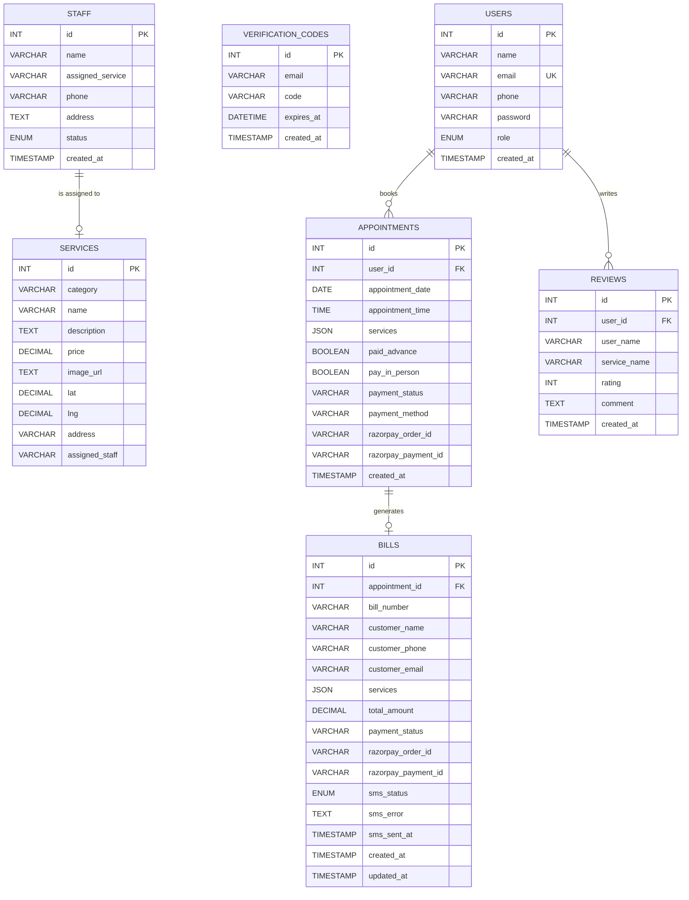

# SALON RESERVATION AND SCHEDULING SYSTEM — StaySync

---

## CHAPTER 1: INTRODUCTION

The contemporary salon industry faces growing demand for streamlined appointment management. Customers often encounter difficulties when attempting to schedule services through traditional phone-based or walk-in methods, leading to long wait times, double bookings, and an overall inefficient experience for both salon operators and clients. As digital transformation continues to reshape service-oriented industries, the need for a dedicated, web-based solution that automates and organizes salon operations has become evident.

StaySync is a web-based salon reservation and scheduling system designed to address these operational challenges. The application provides a unified digital platform where customers can register, authenticate themselves securely, browse a comprehensive catalogue of salon services, book appointments at preferred dates and time slots, and complete payments through integrated online channels. The system replaces manual record-keeping with a structured, database-driven approach that ensures data accuracy and real-time availability tracking.

The application is organized into four primary modules. The Authentication Module handles user registration with email-based OTP verification, secure login with JSON Web Token issuance, password reset workflows, and profile management. The User Dashboard Module enables customers to view their booked appointments, track service statuses such as Pending, Approved, Completed, or Cancelled, cancel bookings, and submit reviews for completed treatments. The Admin Module equips salon administrators with tools to view all appointments across the system, approve or reject individual services, manage staff assignments, monitor analytics through visual dashboards, and generate bills for completed sessions. The Payment Module integrates the Razorpay payment gateway to facilitate secure online transactions, supports an alternative pay-in-person option, and triggers automated bill generation with SMS delivery upon successful payment confirmation.

Users can select services organized under four distinct categories: Hair Services, Skin and Face Services, Body Services, and Makeup Services. Each category contains multiple specific treatments with transparent pricing. The booking interface allows date and time slot selection with built-in validation to prevent past-date bookings and database-level locking to prevent double-booking of the same time slot.

The system is built using a modern technology stack comprising React for the frontend user interface, Node.js with Express for the backend REST API server, and MySQL as the relational database management system. This combination delivers responsive user interfaces, efficient server-side processing, and reliable data persistence with referential integrity.

The primary objective of this project is to deliver a smooth, organized, and efficient salon reservation system that improves the customer experience, reduces administrative overhead, and simplifies the end-to-end appointment management lifecycle from service discovery through payment confirmation.

---

## CHAPTER 2: LITERATURE REVIEW

### 2.1 EXISTING SYSTEM

Traditional salon management predominantly relies on manual processes. Appointment scheduling is typically handled through phone calls or physical walk-ins, with bookings recorded in paper-based registers or basic spreadsheets. This approach introduces several operational limitations that affect both salon staff and customers.

Manual scheduling is inherently susceptible to human error. Double bookings occur when staff members inadvertently assign the same time slot to multiple customers, resulting in delays, customer dissatisfaction, and potential revenue loss. Paper-based records lack real-time accessibility, meaning that if a customer calls while the register is being used at the counter, conflicts are likely to arise.

Payment handling in conventional salons is restricted to cash transactions or standalone card terminals. There is no integrated mechanism linking a customer's appointment record to their payment, making reconciliation a time-consuming end-of-day task. Generating itemized bills requires manual calculation, and maintaining a reliable audit trail is difficult without digital records.

Customer communication in existing systems is reactive rather than proactive. Salons rely on customers to remember their appointment times, and there is no automated mechanism to notify customers about appointment status changes, cancellations, or treatment completions. This absence of communication often leads to no-shows and scheduling gaps.

Staff assignment and availability tracking is another area where manual systems fall short. Without a centralized digital record of which staff member is assigned to which service and whether they are currently active, scheduling conflicts involving staff overlap can occur frequently.

Some salons have adopted generic scheduling tools or third-party booking platforms. While these solutions address basic appointment booking, they typically lack customization for salon-specific workflows such as multi-service bookings within a single session, category-based service catalogues, integrated payment verification with bill generation, or staff-to-service assignment management.

### 2.2 PROPOSED SYSTEM

The proposed StaySync system addresses the limitations of existing approaches through a purpose-built, full-stack web application tailored specifically for salon operations. The system introduces several key improvements over conventional methods.

Automated appointment conflict prevention is achieved through database-level transaction locking. When a customer attempts to book a time slot, the system acquires a row-level lock using SELECT FOR UPDATE queries within a MySQL transaction. This ensures that even under concurrent access scenarios, only one booking can occupy a given time slot, completely eliminating the double-booking problem.

The multi-step authentication workflow incorporates email-based OTP verification during registration. A four-digit verification code is generated, stored with a ten-minute expiry window, and delivered to the user's email address via SMTP integration with Gmail. This ensures that only users with verified email addresses can create accounts, reducing fraudulent registrations.

Integrated payment processing through the Razorpay gateway enables customers to pay online using UPI, credit cards, debit cards, net banking, or digital wallets directly within the application. Payment verification uses HMAC-SHA256 signature validation to ensure transaction authenticity. Upon successful payment, the system automatically generates a bill record and dispatches an SMS notification to the customer's registered mobile number.

The admin dashboard provides a centralized control panel where administrators can view all appointments with customer details, approve or mark services as unavailable on a per-service basis within a session, track payment statuses, generate and view bills, and manage staff records including assignments and availability status.

Real-time service availability is maintained by linking staff records to services. When a staff member is marked as Inactive, the corresponding service is automatically displayed as unavailable on the customer-facing booking page, preventing customers from booking services that cannot be fulfilled.

The review and feedback system allows customers who have received completed treatments to submit star ratings and text comments. These reviews are displayed on the landing page, providing social proof to prospective customers and enabling the salon to gauge service quality.

### 2.3 TOOLS AND TECHNOLOGIES USEDThe following tools and technologies were employed in developing the StaySync system:

**Frontend Technologies:**

- **React (v18.2.0):** Frontend user interface library used for building component-based single-page applications. React enables efficient DOM updates through its virtual DOM mechanism and supports reusable component architecture.

- **React Router DOM (v7.13.2):** Client-side routing library that enables navigation between pages without full page reloads, providing a seamless single-page application experience.

- **Axios (v1.14.0):** Promise-based HTTP client used for making API requests from the frontend to the backend server, supporting request and response interceptors.

- **Recharts (v3.8.1):** Composable charting library built on React components, used for rendering analytics visualizations in the admin dashboard including bar charts and line graphs.

- **Leaflet (v1.9.4) and React-Leaflet (v4.2.1):** Open-source interactive map library and its React wrapper, used for rendering salon location markers and providing navigation directions to customers.

- **Lucide React (v1.7.0):** Icon library providing consistent, customizable SVG icons across the user interface for improved visual communication.

**Backend Technologies:**

- **Node.js (LTS):** Server-side JavaScript runtime environment built on Chrome's V8 engine, used for executing the backend application with its event-driven, non-blocking I/O model.

- **Express (v5.2.1):** Minimal and flexible Node.js web application framework used for building the RESTful API layer, handling routing, middleware integration, and HTTP request processing.

- **MySQL (v8.x):** Relational database management system used for structured data storage, providing ACID-compliant transaction support and referential integrity through foreign key constraints.

- **mysql2 (v3.20.0):** Node.js MySQL driver providing Promise-based API and connection pooling capabilities for efficient database communication.

- **bcrypt (v6.0.0):** Password hashing library implementing the Blowfish cipher algorithm, used for securely hashing user passwords before storage with configurable salt rounds.

- **JSON Web Token / jsonwebtoken (v9.0.3):** Library for generating and verifying JSON Web Tokens, enabling stateless token-based authentication and session management.

- **Nodemailer (v8.0.4):** Email sending library used for delivering OTP verification codes during registration and sending appointment status notification emails through Gmail SMTP.

- **Razorpay SDK (v2.9.6):** Server-side SDK for integrating the Razorpay payment gateway, handling order creation and payment signature verification using HMAC-SHA256.

- **dotenv (v17.3.1):** Environment variable loader that reads configuration secrets from a .env file, keeping sensitive credentials such as database passwords and API keys out of source code.

- **CORS (v2.8.6):** Express middleware for configuring Cross-Origin Resource Sharing policies, controlling which frontend origins are permitted to make API requests to the backend.

- **Nodemon (v3.1.14):** Development utility that monitors source file changes and automatically restarts the Node.js server, improving the development workflow efficiency.

**Development and Deployment Tools:**

- **Visual Studio Code (Latest):** Integrated development environment used for writing, editing, and debugging both frontend and backend code with extension support for JavaScript and React.

- **Git (Latest):** Distributed version control system used for tracking source code changes, managing branches, and maintaining project history.

- **Vercel:** Cloud platform used for deploying the React frontend application, providing automatic builds from Git repositories, CDN distribution, and HTTPS encryption.

- **Render:** Cloud platform used for deploying the Node.js backend application as a web service, supporting environment variable configuration and automatic deployments. — |

---

## CHAPTER 3: SYSTEM REQUIREMENTS

### 3.1 HARDWARE REQUIREMENTS

The following hardware specifications represent the minimum and recommended configurations for developing, testing, and deploying the StaySync application.

**For Development and Testing:**

The development workstation requires a processor with a minimum of Intel Core i3 or equivalent dual-core capability, though an Intel Core i5 or higher quad-core processor is recommended for efficient compilation and testing. The system should have at least 4 GB of RAM, with 8 GB or higher recommended to support simultaneous execution of the frontend development server, backend server, and MySQL database. A minimum of 20 GB of free disk space is required for project files, node modules, and database storage, though 50 GB of SSD storage is recommended for improved build performance. The display should support at least 1366 by 768 resolution, with 1920 by 1080 recommended for comfortable development. A broadband internet connection is required for downloading dependencies and accessing cloud services, with a stable connection of at least 10 Mbps recommended. Standard keyboard and mouse input devices are sufficient.

**For Server Deployment:**

The production server requires a single-core or dual-core virtual CPU. Memory allocation should be 512 MB at minimum, with 1 GB recommended for stable operation under concurrent access. Storage of 10 GB SSD is sufficient for the application, database, and log files. A stable internet connection with a static IP address or cloud hosting platform is required. The server operating system should be Linux-based, with Ubuntu 20.04 or later recommended for its long-term support and compatibility with Node.js deployment tools.

**For End Users (Client-Side):**

End users can access the application from any device including desktops, laptops, tablets, or smartphones. The web browser must be a recent version of Google Chrome, Mozilla Firefox, Microsoft Edge, or Safari. An active internet connection is required for all interactions with the system. The responsive design supports viewport widths starting from 320 pixels, ensuring usability across all screen sizes.

### 3.2 SOFTWARE REQUIREMENTS

**For Development Environment:**

The development environment requires Windows 10 or 11, macOS, or Ubuntu Linux as the operating system. Node.js runtime version 18.x LTS or later must be installed, which bundles npm (Node Package Manager) version 9.x or later for managing project dependencies. MySQL Server version 8.0 or later is required for the relational database. Visual Studio Code is the recommended code editor due to its extensive extension ecosystem for JavaScript and React development. Google Chrome with its built-in Developer Tools is the primary browser for testing and debugging. Git version 2.x is required for version control and source code management. Postman or cURL may be used for testing API endpoints during development.

**For Production Deployment:**

The frontend application is deployed on Vercel, which provides static site deployment with automatic CDN distribution and HTTPS encryption. The backend Node.js application is hosted on Render as a web service, supporting environment variable configuration and automatic deployments from the Git repository. The MySQL database is hosted on Railway or an equivalent cloud-hosted MySQL instance that provides managed database services with automated backups. SSL/TLS encryption is enabled through the hosting platforms to ensure all data transmission occurs over HTTPS. Gmail SMTP with application-specific password authentication is used for email delivery including OTP codes and appointment notifications. The Razorpay payment gateway is integrated in either test or live mode for processing online payments. The SMSLocal API serves as the SMS gateway for bill notifications, with a mock mode available for development and testing environments.

---

## CHAPTER 4: SOFTWARE REQUIREMENT SPECIFICATION

### 4.1 INTRODUCTION

This chapter defines the software requirements for the StaySync Salon Reservation and Scheduling System. The specification follows a structured approach to document what the system must do (functional requirements), how the system must perform (non-functional requirements), how users and external systems interact with it (interface requirements), and what limitations govern its design and operation (constraints).

The StaySync system serves two primary user roles: regular users (customers) who book salon services and make payments, and administrators who manage appointments, staff, and operational analytics. The system must support concurrent access from multiple users while maintaining data consistency, security, and responsiveness.

### 4.2 FUNCTIONAL REQUIREMENTS

**FR-01: User Registration**
The system shall allow new users to register by providing their full name, email address, ten-digit mobile number, and a password. Registration shall require email verification through a four-digit OTP code sent to the provided email address. The OTP shall expire after ten minutes. Passwords must contain a minimum of six characters, at least one uppercase letter, and at least one numeric digit.

**FR-02: User Authentication**
The system shall authenticate registered users using email and password credentials. Upon successful authentication, the system shall issue a JSON Web Token valid for thirty days. The token shall be included in subsequent API requests for authorization.

**FR-03: Password Reset**
The system shall allow users to reset their password through an email-based OTP verification flow. The user provides their registered email, receives a reset code, verifies the code, and sets a new password meeting the same strength requirements as registration.

**FR-04: Profile Management**
Authenticated users shall be able to update their name and mobile number through a profile management interface. Email addresses shall remain immutable after registration.

**FR-05: Service Catalogue Browsing**
The system shall display all available salon services organized by category (Hair Services, Skin/Face Services, Body Services, Makeup Services). Each service listing shall show the service name, description, price, and availability status based on assigned staff activity.

**FR-06: Appointment Booking**
Authenticated users shall be able to select one or more services, choose a date (no past dates permitted), select a time slot, and submit a booking request. The system shall prevent double-booking of time slots using database-level transaction locking.

**FR-07: Appointment Viewing**
Users shall be able to view their own appointment history with service details, status indicators, and payment status. Administrators shall be able to view all appointments across all users with additional customer contact information.

**FR-08: Appointment Status Management**
Administrators shall be able to update individual service statuses within an appointment to Approved, Not Available, or Completed. When all services in a session are reviewed, an automated email notification shall be sent to the customer.

**FR-09: Appointment Cancellation**
Both users and administrators shall be able to cancel appointment sessions. Cancellation shall update all service statuses to Cancelled and trigger an email notification to the affected customer.

**FR-10: Online Payment Processing**
The system shall integrate with the Razorpay payment gateway to accept online payments via UPI, cards, net banking, and wallets. Payment verification shall use HMAC-SHA256 signature validation.

**FR-11: Pay-in-Person Option**
Users shall have the option to mark an appointment for in-person payment at the salon counter as an alternative to online payment.

**FR-12: Bill Generation**
Upon successful online payment verification, the system shall automatically generate a bill record containing customer details, itemized services, total amount, and payment reference identifiers.

**FR-13: SMS Notification**
The system shall attempt to send bill details via SMS to the customer's registered mobile number upon bill generation. The system shall support both live SMS delivery (via SMSLocal API) and mock mode for development.

**FR-14: Review Submission**
Users shall be able to submit a star rating (one to five) and optional text comment for services that have been marked as Completed. Each user may submit only one review per service.

**FR-15: Staff Management**
Administrators shall be able to create, update, and delete staff records. Each staff member shall have a name, assigned service, phone number, address, and active/inactive status.

**FR-16: Analytics Dashboard**
Administrators shall have access to an analytics dashboard displaying appointment trends, revenue metrics, and service popularity through interactive charts.

**FR-17: Appointment Search**
Administrators shall be able to search appointments by customer phone number or name to quickly locate specific booking records.

**FR-18: Location Services**
The system shall display salon locations on an interactive map using Leaflet, allowing customers to view addresses and get directions to service locations.

### 4.3 NON-FUNCTIONAL REQUIREMENTS

**NFR-01: Performance**
The system shall render pages within three seconds on a standard broadband connection. API responses for standard CRUD operations shall complete within five hundred milliseconds under normal load.

**NFR-02: Security**
All passwords shall be hashed using bcrypt with a salt factor of ten before storage. Authentication tokens shall be signed using a server-side secret key. Payment signatures shall be verified using HMAC-SHA256. API endpoints shall enforce role-based access control differentiating between user and admin roles.

**NFR-03: Scalability**
The backend shall use a MySQL connection pool with a configurable connection limit (default ten connections) to handle concurrent database operations efficiently.

**NFR-04: Availability**
The system shall be deployed on cloud platforms (Vercel for frontend, Render for backend) that provide automatic scaling and uptime monitoring.

**NFR-05: Usability**
The user interface shall follow responsive design principles, functioning correctly on viewport widths ranging from 320 pixels (mobile devices) to 1920 pixels and above (desktop displays). The interface shall use a consistent dark theme with high-contrast text for readability.

**NFR-06: Maintainability**
The codebase shall follow a modular architecture with clear separation between routes, controllers, middleware, and utilities on the backend, and between pages, components, and configuration on the frontend.

**NFR-07: Data Integrity**
The database schema shall enforce referential integrity through foreign key constraints with CASCADE delete rules. Appointment booking shall use database transactions with row-level locking to prevent race conditions.

**NFR-08: Reliability**
The system shall implement graceful error handling with meaningful error messages returned to the client. SMTP failures during OTP delivery shall fall back to a mock mode displaying the code directly.

### 4.4 INTERFACE REQUIREMENTS

#### 4.4.1 User Interface Requirements

The user interface shall be implemented as a single-page application using React. The interface shall include the following primary screens:

- **Landing Page**: Hero section with salon branding, call-to-action buttons for service exploration and location finding, and a customer reviews section displaying recent testimonials.

- **Authentication Page**: Tabbed interface supporting login and registration modes. Registration follows a three-step wizard (Details → Verify OTP → Set Password) with visual step indicators. Login includes email/password fields with a password visibility toggle and forgot password link.

- **Services Page**: Category-organized service catalogue with expandable service cards showing descriptions, pricing, and add-to-cart functionality. A sidebar booking form displays selected services with date and time pickers.

- **Appointments Page**: List of user's booked sessions displaying service details, status indicators with colour coding (Pending in amber, Approved in blue, Completed in green, Cancelled in red), payment options, bill viewing, and review submission.

- **Admin Dashboard**: Grid layout displaying all appointment cards with customer information, per-service status management buttons (Approve, Complete, N/A), payment status, bill generation, and session cancellation.

- **Profile Page**: Form for viewing and editing user profile details including name and phone number.

- **Map Page**: Interactive Leaflet map displaying salon locations with address markers and navigation support.

- **Contact Page**: Salon contact information and communication details.

All interface elements shall use consistent styling with CSS custom properties (variables) for colours, fonts, and spacing to ensure visual coherence across all pages.

#### 4.4.2 Hardware Interface Requirements

The system does not interface directly with specialized hardware. It communicates through standard web protocols:

- **Client Devices**: The frontend communicates with user devices through standard HTTP/HTTPS web browsers. No plugins, extensions, or native installations are required.

- **Server Hardware**: The backend application interfaces with the hosting server's CPU, memory, and network resources through the Node.js runtime. Database communication occurs over TCP connections on port 3306 (MySQL default).

- **Network Interface**: All communication between the frontend and backend occurs over HTTPS using RESTful API calls with JSON payloads. CORS policies control which origins are permitted to make cross-origin requests.

### 4.5 CONSTRAINTS

**C-01: Technology Constraints**
The frontend is built using React 18 with Create React App tooling, which limits certain build configuration options compared to fully customizable bundlers. The backend uses Express 5 on Node.js, which operates on a single-threaded event loop model.

**C-02: Third-Party Service Dependencies**
The payment module depends on the Razorpay payment gateway being operational and accessible. If Razorpay experiences downtime, online payments will be temporarily unavailable, though the pay-in-person option remains functional. Email delivery depends on Gmail SMTP availability and valid application-specific password configuration.

**C-03: Database Constraints**
The MySQL database enforces a maximum connection pool limit of ten concurrent connections by default. The services JSON column in the appointments table stores service details as a JSON string, which limits query-based filtering on individual service attributes.

**C-04: Authentication Constraints**
JWT tokens have a fixed thirty-day expiry period and cannot be individually revoked before expiration without implementing a token blacklist mechanism, which is outside the current system scope.

**C-05: SMS Delivery Constraints**
SMS delivery through SMSLocal is subject to DLT template registration requirements for Indian regulatory compliance. Promotional SMS routes are restricted to operating hours between 9:00 AM and 8:45 PM.

**C-06: Browser Compatibility**
The application relies on modern JavaScript features (ES6+) and CSS properties. Internet Explorer is not supported. Users must use current versions of Chrome, Firefox, Edge, or Safari.

---

## CHAPTER 5: SYSTEM DESIGN

### 5.1 DATA FLOW DIAGRAM

**Figure 5.1: Level 0 — Context Diagram**

(Space reserved for printed figure)

**Figure 5.2: Level 1 — Data Flow Diagram**

(Space reserved for printed figure)

### 5.2 USE CASE DIAGRAM

**Figure 5.3: Use Case Diagram — StaySync System**

```mermaid
graph TD
    subgraph StaySync System
        UC1["Register with OTP Verification"]
        UC2["Login"]
        UC3["Reset Password"]
        UC4["Browse Services"]
        UC5["Book Appointment"]
        UC6["View My Appointments"]
        UC7["Cancel Appointment"]
        UC8["Pay Online via Razorpay"]
        UC9["Pay In Person"]
        UC10["View Bill"]
        UC11["Submit Review"]
        UC12["Update Profile"]
        UC13["View All Appointments"]
        UC14["Approve or Reject Service"]
        UC15["Mark Service Completed"]
        UC16["Cancel Session"]
        UC17["Generate Bill"]
        UC18["Manage Staff CRUD"]
        UC19["Search Appointments"]
        UC20["View Analytics Dashboard"]
        UC21["View Map Location"]
    end

    User["User / Customer"] --> UC1
    User --> UC2
    User --> UC3
    User --> UC4
    User --> UC5
    User --> UC6
    User --> UC7
    User --> UC8
    User --> UC9
    User --> UC10
    User --> UC11
    User --> UC12
    User --> UC21

    Admin["Administrator"] --> UC2
    Admin --> UC13
    Admin --> UC14
    Admin --> UC15
    Admin --> UC16
    Admin --> UC17
    Admin --> UC18
    Admin --> UC19
    Admin --> UC20
```

(Space reserved for printed figure)

### 5.3 ACTIVITY DIAGRAM

**Figure 5.4: Activity Diagram — User Registration Process**

(Space reserved for printed figure)

**Figure 5.5: Activity Diagram — Appointment Booking Process**

(Space reserved for printed figure)

**Figure 5.6: Activity Diagram — Payment Process**

(Space reserved for printed figure)

### 5.4 ER — DIAGRAM

**Figure 5.7: Entity-Relationship Diagram — StaySync Database**

(Space reserved for printed figure)

---

*End of Sprint 1 — Chapters 1 through 5*
